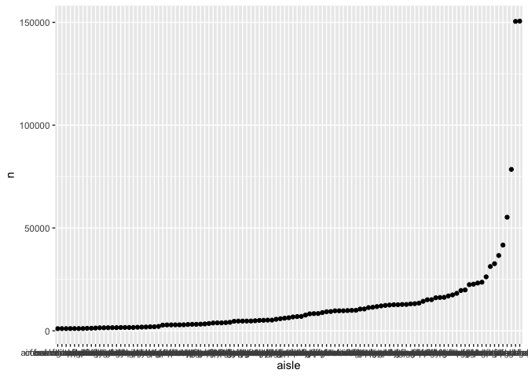

Homework 3
================

``` r
library(tidyverse)
```

    ## ── Attaching packages ─────────────────────────────────────────────────── tidyverse 1.3.0 ──

    ## ✓ ggplot2 3.3.2     ✓ purrr   0.3.4
    ## ✓ tibble  3.0.3     ✓ dplyr   1.0.2
    ## ✓ tidyr   1.1.2     ✓ stringr 1.4.0
    ## ✓ readr   1.3.1     ✓ forcats 0.5.0

    ## ── Conflicts ────────────────────────────────────────────────────── tidyverse_conflicts() ──
    ## x dplyr::filter() masks stats::filter()
    ## x dplyr::lag()    masks stats::lag()

``` r
library(p8105.datasets)
```

\#\#Problem 1

``` r
data('instacart')
```

The `instacart` dataset contains 1384617 observations (representing
products from orders) and 15 variables. The key variables in the
`instacart` dataset include `reordered`, which describes if this product
has been ordered by this user in the past,`order_dow`, which describes
the day in which the order was placed, and `order_hour_of_day`, the hour
of the day on which the order was placed. There are also item variables
- name, aisle, department, and some numeric codes.

How many aisles and which are most items from?

``` r
instacart %>%
  count(aisle)%>%
  arrange(desc(n))
```

    ## # A tibble: 134 x 2
    ##    aisle                              n
    ##    <chr>                          <int>
    ##  1 fresh vegetables              150609
    ##  2 fresh fruits                  150473
    ##  3 packaged vegetables fruits     78493
    ##  4 yogurt                         55240
    ##  5 packaged cheese                41699
    ##  6 water seltzer sparkling water  36617
    ##  7 milk                           32644
    ##  8 chips pretzels                 31269
    ##  9 soy lactosefree                26240
    ## 10 bread                          23635
    ## # … with 124 more rows

The aisles that the most items are ordered from are “fresh vegetables”
(150609 orders) and “fresh fruit” (150473 orders).

Making a plot

``` r
instacart %>%
  count(aisle) %>%
  filter (n>1000) %>%
  mutate(
    aisle = factor(aisle),
    aisle = fct_reorder(aisle,n)
  ) %>%
  ggplot(aes(x=aisle,y=n)) +
  geom_point()
```

<!-- -->

``` r
  theme(axis.text.x = element_text(angle = 270, vjust = 0.5, hjust = 1 ))
```

    ## List of 1
    ##  $ axis.text.x:List of 11
    ##   ..$ family       : NULL
    ##   ..$ face         : NULL
    ##   ..$ colour       : NULL
    ##   ..$ size         : NULL
    ##   ..$ hjust        : num 1
    ##   ..$ vjust        : num 0.5
    ##   ..$ angle        : num 270
    ##   ..$ lineheight   : NULL
    ##   ..$ margin       : NULL
    ##   ..$ debug        : NULL
    ##   ..$ inherit.blank: logi FALSE
    ##   ..- attr(*, "class")= chr [1:2] "element_text" "element"
    ##  - attr(*, "class")= chr [1:2] "theme" "gg"
    ##  - attr(*, "complete")= logi FALSE
    ##  - attr(*, "validate")= logi TRUE
