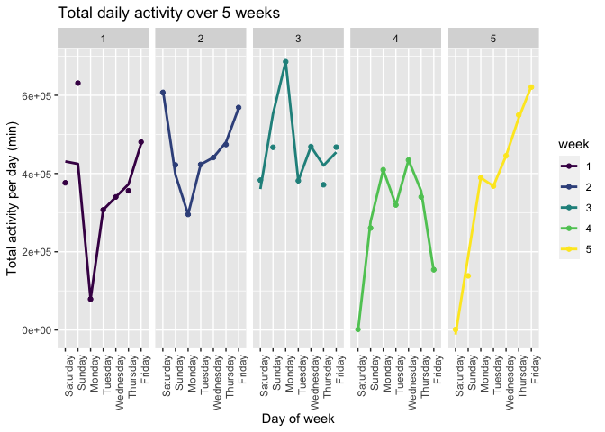
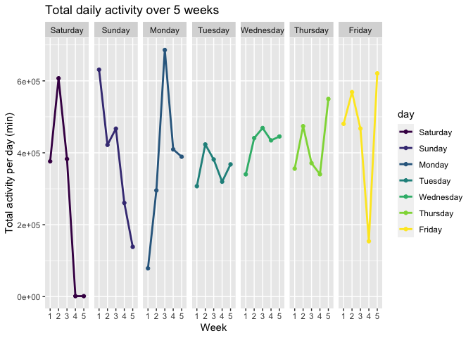
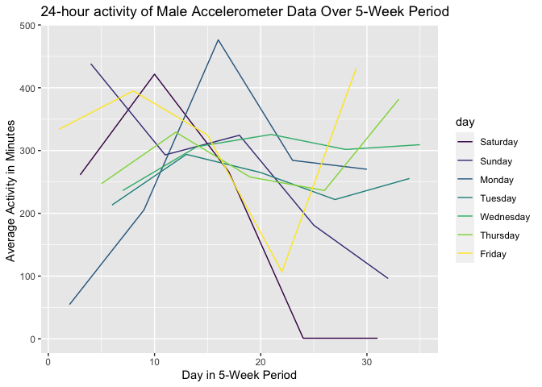
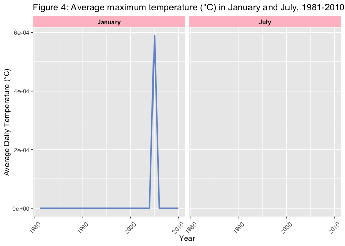
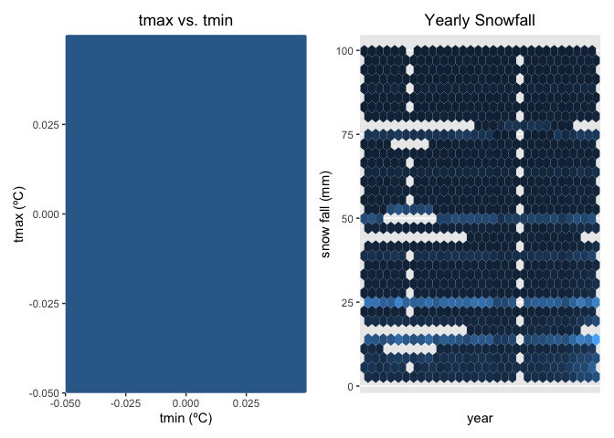

Homework 3
================

``` r
library(tidyverse)
```

    ## ── Attaching packages ─────────────────────────────────────────────────── tidyverse 1.3.0 ──

    ## ✓ ggplot2 3.3.2     ✓ purrr   0.3.4
    ## ✓ tibble  3.0.3     ✓ dplyr   1.0.2
    ## ✓ tidyr   1.1.2     ✓ stringr 1.4.0
    ## ✓ readr   1.3.1     ✓ forcats 0.5.0

    ## ── Conflicts ────────────────────────────────────────────────────── tidyverse_conflicts() ──
    ## x dplyr::filter() masks stats::filter()
    ## x dplyr::lag()    masks stats::lag()

``` r
library(p8105.datasets)
library(patchwork)
```

\#\#Problem 1

``` r
data('instacart')
```

The `instacart` dataset contains 1384617 observations (representing
products from orders) and 15 variables. The key variables in the
`instacart` dataset include `reordered`, which describes if this product
has been ordered by this user in the past,`order_dow`, which describes
the day in which the order was placed, and `order_hour_of_day`, the hour
of the day on which the order was placed. There are also item variables
- name, aisle, department, and some numeric codes.

How many aisles and which are most items from?

``` r
instacart %>%
  count(aisle)%>%
  arrange(desc(n))
```

    ## # A tibble: 134 x 2
    ##    aisle                              n
    ##    <chr>                          <int>
    ##  1 fresh vegetables              150609
    ##  2 fresh fruits                  150473
    ##  3 packaged vegetables fruits     78493
    ##  4 yogurt                         55240
    ##  5 packaged cheese                41699
    ##  6 water seltzer sparkling water  36617
    ##  7 milk                           32644
    ##  8 chips pretzels                 31269
    ##  9 soy lactosefree                26240
    ## 10 bread                          23635
    ## # … with 124 more rows

The aisles that the most items are ordered from are “fresh vegetables”
(150609 orders) and “fresh fruit” (150473 orders).

Making a plot

``` r
instacart %>%
  count(aisle) %>%
  filter (n>1000) %>%
  mutate(
    aisle = factor(aisle),
    aisle = fct_reorder(aisle,n)
  ) %>%
  ggplot(aes(x=aisle,y=n)) +
  geom_point()
```

<!-- -->

``` r
  theme(axis.text.x = element_text(angle = 270, vjust = 0.5, hjust = 1 ))
```

    ## List of 1
    ##  $ axis.text.x:List of 11
    ##   ..$ family       : NULL
    ##   ..$ face         : NULL
    ##   ..$ colour       : NULL
    ##   ..$ size         : NULL
    ##   ..$ hjust        : num 1
    ##   ..$ vjust        : num 0.5
    ##   ..$ angle        : num 270
    ##   ..$ lineheight   : NULL
    ##   ..$ margin       : NULL
    ##   ..$ debug        : NULL
    ##   ..$ inherit.blank: logi FALSE
    ##   ..- attr(*, "class")= chr [1:2] "element_text" "element"
    ##  - attr(*, "class")= chr [1:2] "theme" "gg"
    ##  - attr(*, "complete")= logi FALSE
    ##  - attr(*, "validate")= logi TRUE

Making a table

``` r
instacart %>% 
  filter(aisle %in% c("baking ingredients","dog food care","packaged vegetables fruits")) %>%
  group_by(aisle) %>%
  count(product_name) %>%
  mutate(rank = min_rank(desc(n))) %>%
  filter(rank < 4) %>%
  arrange(aisle,rank) %>%
  knitr::kable()
```

| aisle                      | product\_name                                 |    n | rank |
| :------------------------- | :-------------------------------------------- | ---: | ---: |
| baking ingredients         | Light Brown Sugar                             |  499 |    1 |
| baking ingredients         | Pure Baking Soda                              |  387 |    2 |
| baking ingredients         | Cane Sugar                                    |  336 |    3 |
| dog food care              | Snack Sticks Chicken & Rice Recipe Dog Treats |   30 |    1 |
| dog food care              | Organix Chicken & Brown Rice Recipe           |   28 |    2 |
| dog food care              | Small Dog Biscuits                            |   26 |    3 |
| packaged vegetables fruits | Organic Baby Spinach                          | 9784 |    1 |
| packaged vegetables fruits | Organic Raspberries                           | 5546 |    2 |
| packaged vegetables fruits | Organic Blueberries                           | 4966 |    3 |

## Problem 2

Loading, tidying and wrangling data:

``` r
accel_data = 
  read_csv("./data/accel_data.csv",col_names = TRUE ) %>%
  janitor::clean_names() %>%
  mutate(
    weekend = recode(day, "Saturday" = 1, "Sunday" = 1, "Monday" = 0, "Tuesday" = 0, "Wednesday" = 0, "Thursday" = 0, "Friday" = 0),
    weekday = recode(day, "Saturday" = 0, "Sunday" = 0, "Monday" = 1, "Tuesday" = 1, "Wednesday" = 1, "Thursday" = 1, "Friday" = 1),
    day = ordered(day, c("Saturday", "Sunday", "Monday", "Tuesday", "Wednesday", "Thursday", "Friday")),
    week = ordered(week, c("1", "2", "3", "4", "5"))) %>% 
  select(week, day_id, day, weekend, weekday, everything()) %>% 
  pivot_longer(
    cols = starts_with("activity_"),
    names_to = "activity_minute_num",
    names_prefix = "activity_",
    values_to = "activity_counts") %>% 
  mutate(activity_minute_num = as.numeric(activity_minute_num))
```

    ## Parsed with column specification:
    ## cols(
    ##   .default = col_double(),
    ##   day = col_character()
    ## )

    ## See spec(...) for full column specifications.

The `accel_data` dataset contains 50400 observations and 7 variables.
The 7 variables in the dataset are `week`, `day_id`, `day`, `weekend`,
`weekday`, `activity_minute_num`, and `activity_counts`.

## Aggregate accross minutes to create a total activity variable for each day, and create a table showing these totals, check for trends.

``` r
total_act = accel_data %>% 
  group_by(week, day_id, day) %>% 
  summarize (total_min = sum(activity_counts))
```

    ## `summarise()` regrouping output by 'week', 'day_id' (override with `.groups` argument)

``` r
knitr::kable(total_act)
```

| week | day\_id | day       | total\_min |
| :--- | ------: | :-------- | ---------: |
| 1    |       1 | Friday    |  480542.62 |
| 1    |       2 | Monday    |   78828.07 |
| 1    |       3 | Saturday  |  376254.00 |
| 1    |       4 | Sunday    |  631105.00 |
| 1    |       5 | Thursday  |  355923.64 |
| 1    |       6 | Tuesday   |  307094.24 |
| 1    |       7 | Wednesday |  340115.01 |
| 2    |       8 | Friday    |  568839.00 |
| 2    |       9 | Monday    |  295431.00 |
| 2    |      10 | Saturday  |  607175.00 |
| 2    |      11 | Sunday    |  422018.00 |
| 2    |      12 | Thursday  |  474048.00 |
| 2    |      13 | Tuesday   |  423245.00 |
| 2    |      14 | Wednesday |  440962.00 |
| 3    |      15 | Friday    |  467420.00 |
| 3    |      16 | Monday    |  685910.00 |
| 3    |      17 | Saturday  |  382928.00 |
| 3    |      18 | Sunday    |  467052.00 |
| 3    |      19 | Thursday  |  371230.00 |
| 3    |      20 | Tuesday   |  381507.00 |
| 3    |      21 | Wednesday |  468869.00 |
| 4    |      22 | Friday    |  154049.00 |
| 4    |      23 | Monday    |  409450.00 |
| 4    |      24 | Saturday  |    1440.00 |
| 4    |      25 | Sunday    |  260617.00 |
| 4    |      26 | Thursday  |  340291.00 |
| 4    |      27 | Tuesday   |  319568.00 |
| 4    |      28 | Wednesday |  434460.00 |
| 5    |      29 | Friday    |  620860.00 |
| 5    |      30 | Monday    |  389080.00 |
| 5    |      31 | Saturday  |    1440.00 |
| 5    |      32 | Sunday    |  138421.00 |
| 5    |      33 | Thursday  |  549658.00 |
| 5    |      34 | Tuesday   |  367824.00 |
| 5    |      35 | Wednesday |  445366.00 |

``` r
trends_wk = total_act %>% 
  ggplot(aes(x = day, y = total_min, color = week, group = week)) + 
  geom_point() +
  geom_smooth(se = FALSE) +
  facet_grid(~week) +
  labs(
    title = "Total daily activity over 5 weeks",
    x = "Day of week",
    y = "Total activity per day (min)") +
  theme(axis.text.x = element_text(angle = 90, hjust = 1))

trends_wk
```

    ## `geom_smooth()` using method = 'loess' and formula 'y ~ x'

<!-- -->

``` r
trends_day = total_act %>% 
  ggplot(aes(x = week, y = total_min, color = day, group = day)) + 
  geom_point() +
  geom_smooth(se = FALSE) +
  facet_grid(~day) +
  labs(
    title = "Total daily activity over 5 weeks",
    x = "Week",
    y = "Total activity per day (min)") 
trends_day
```

    ## `geom_smooth()` using method = 'loess' and formula 'y ~ x'

    ## Warning in simpleLoess(y, x, w, span, degree = degree, parametric =
    ## parametric, : span too small. fewer data values than degrees of freedom.

    ## Warning in simpleLoess(y, x, w, span, degree = degree, parametric =
    ## parametric, : pseudoinverse used at 0.98

    ## Warning in simpleLoess(y, x, w, span, degree = degree, parametric =
    ## parametric, : neighborhood radius 2.02

    ## Warning in simpleLoess(y, x, w, span, degree = degree, parametric =
    ## parametric, : reciprocal condition number 0

    ## Warning in simpleLoess(y, x, w, span, degree = degree, parametric =
    ## parametric, : There are other near singularities as well. 4.0804

    ## Warning in simpleLoess(y, x, w, span, degree = degree, parametric =
    ## parametric, : span too small. fewer data values than degrees of freedom.

    ## Warning in simpleLoess(y, x, w, span, degree = degree, parametric =
    ## parametric, : pseudoinverse used at 0.98

    ## Warning in simpleLoess(y, x, w, span, degree = degree, parametric =
    ## parametric, : neighborhood radius 2.02

    ## Warning in simpleLoess(y, x, w, span, degree = degree, parametric =
    ## parametric, : reciprocal condition number 0

    ## Warning in simpleLoess(y, x, w, span, degree = degree, parametric =
    ## parametric, : There are other near singularities as well. 4.0804

    ## Warning in simpleLoess(y, x, w, span, degree = degree, parametric =
    ## parametric, : span too small. fewer data values than degrees of freedom.

    ## Warning in simpleLoess(y, x, w, span, degree = degree, parametric =
    ## parametric, : pseudoinverse used at 0.98

    ## Warning in simpleLoess(y, x, w, span, degree = degree, parametric =
    ## parametric, : neighborhood radius 2.02

    ## Warning in simpleLoess(y, x, w, span, degree = degree, parametric =
    ## parametric, : reciprocal condition number 0

    ## Warning in simpleLoess(y, x, w, span, degree = degree, parametric =
    ## parametric, : There are other near singularities as well. 4.0804

    ## Warning in simpleLoess(y, x, w, span, degree = degree, parametric =
    ## parametric, : span too small. fewer data values than degrees of freedom.

    ## Warning in simpleLoess(y, x, w, span, degree = degree, parametric =
    ## parametric, : pseudoinverse used at 0.98

    ## Warning in simpleLoess(y, x, w, span, degree = degree, parametric =
    ## parametric, : neighborhood radius 2.02

    ## Warning in simpleLoess(y, x, w, span, degree = degree, parametric =
    ## parametric, : reciprocal condition number 0

    ## Warning in simpleLoess(y, x, w, span, degree = degree, parametric =
    ## parametric, : There are other near singularities as well. 4.0804

    ## Warning in simpleLoess(y, x, w, span, degree = degree, parametric =
    ## parametric, : span too small. fewer data values than degrees of freedom.

    ## Warning in simpleLoess(y, x, w, span, degree = degree, parametric =
    ## parametric, : pseudoinverse used at 0.98

    ## Warning in simpleLoess(y, x, w, span, degree = degree, parametric =
    ## parametric, : neighborhood radius 2.02

    ## Warning in simpleLoess(y, x, w, span, degree = degree, parametric =
    ## parametric, : reciprocal condition number 0

    ## Warning in simpleLoess(y, x, w, span, degree = degree, parametric =
    ## parametric, : There are other near singularities as well. 4.0804

    ## Warning in simpleLoess(y, x, w, span, degree = degree, parametric =
    ## parametric, : span too small. fewer data values than degrees of freedom.

    ## Warning in simpleLoess(y, x, w, span, degree = degree, parametric =
    ## parametric, : pseudoinverse used at 0.98

    ## Warning in simpleLoess(y, x, w, span, degree = degree, parametric =
    ## parametric, : neighborhood radius 2.02

    ## Warning in simpleLoess(y, x, w, span, degree = degree, parametric =
    ## parametric, : reciprocal condition number 0

    ## Warning in simpleLoess(y, x, w, span, degree = degree, parametric =
    ## parametric, : There are other near singularities as well. 4.0804

    ## Warning in simpleLoess(y, x, w, span, degree = degree, parametric =
    ## parametric, : span too small. fewer data values than degrees of freedom.

    ## Warning in simpleLoess(y, x, w, span, degree = degree, parametric =
    ## parametric, : pseudoinverse used at 0.98

    ## Warning in simpleLoess(y, x, w, span, degree = degree, parametric =
    ## parametric, : neighborhood radius 2.02

    ## Warning in simpleLoess(y, x, w, span, degree = degree, parametric =
    ## parametric, : reciprocal condition number 0

    ## Warning in simpleLoess(y, x, w, span, degree = degree, parametric =
    ## parametric, : There are other near singularities as well. 4.0804

<!-- -->
There are no obvious trends or patterns that stand out when looking at
the `accel_data` dataset. Once we take a closer look, we can see that
for the first two weeks(week 1 and week 2), the total activity per day
is lowest on Mondays and then increases throughout the week.
Additionally, for weeks 4 and 5, we can see that Saturdays and Sundays
have the lowest total activity per day.

\#\#Make a single-panel plot that shows the 24-hour activity time
courses for each day and use color to indicate day of the week. Describe
in words any patterns or conclusions you can make based on this graph.

``` r
accel_plot = accel_data %>% 
  group_by(week, day_id, day) %>% 
  summarize (average_min = mean(activity_counts)) %>% 
  ggplot(aes(x = day_id, y = average_min, color = day)) +
  geom_line() +
  labs(
    title = "24-hour activity of Male Accelerometer Data Over 5-Week Period",
    x = "Day in 5-Week Period",
    y = "Average Activity in Minutes "
  )
```

    ## `summarise()` regrouping output by 'week', 'day_id' (override with `.groups` argument)

``` r
accel_plot
```

<!-- -->
Similar to the previous plot, we can see here that the average activity
for Monday was very low, and increased throughout the week. However,
from this plot we also notice that the average activity for Saturday and
Sunday were high and then decreased throughout the week.

\#\#Problem 3

``` r
library(tidyverse)
library(ggplot2)
library(ggridges)
library(patchwork)
library(hexbin)
```

``` r
noa_data = 
  read_csv("./data/nynoaadat.csv", col_names = TRUE) %>%
  janitor::clean_names() %>%
  separate(date,c("year","month","day"),sep = "-") %>% 
  mutate(tmax = as.double(tmax) / 10, 
         tmin = as.double(tmin) / 10, 
         prcp = prcp / 10,
         month = month.name[as.integer(month)], 
         year = as.integer(year))
```

    ## Parsed with column specification:
    ## cols(
    ##   id = col_character(),
    ##   date = col_date(format = ""),
    ##   prcp = col_double(),
    ##   snow = col_double(),
    ##   snwd = col_double(),
    ##   tmax = col_logical(),
    ##   tmin = col_logical()
    ## )

    ## Warning: 2870416 parsing failures.
    ##    row  col           expected actual                   file
    ## 294144 tmax 1/0/T/F/TRUE/FALSE   -56  './data/nynoaadat.csv'
    ## 294145 tmax 1/0/T/F/TRUE/FALSE   -89  './data/nynoaadat.csv'
    ## 294146 tmax 1/0/T/F/TRUE/FALSE   -122 './data/nynoaadat.csv'
    ## 294146 tmin 1/0/T/F/TRUE/FALSE   -206 './data/nynoaadat.csv'
    ## 294147 tmax 1/0/T/F/TRUE/FALSE   -94  './data/nynoaadat.csv'
    ## ...... .... .................. ...... ......................
    ## See problems(...) for more details.

The `noa_data` dataset that we are using comes from The National Oceanic
and Atmospheric Association(NOAA) and it provides us with summary
statistics from weather stations in New York state. The `noa_data`
dataset contains 2,595,176 rows (observations) and 7 columns
(variables). The key variables in this dataset are: date, tmax, tmin,
prcp and snow, indicating date, maximum temperature, precipitation, and
snowfall. The variables prcp, snow, snwd, tmax, and tmin have missing
data. Specifically, prcp is missing 145838 values, snow is missing
381221 values, snwd is missing 591786 values, tmax is missing 1134358
values, and tmin is missing 1134420 values. Missing data does seem to be
a significant issue in this dataset because of the large number of
values missing.

For snowfall, what are the most commonly observed values? Why?

``` r
noa_data %>% 
  group_by(snow) %>% 
  summarize(number_time_snow = n()) %>% 
  arrange(min_rank(desc(number_time_snow)))
```

    ## `summarise()` ungrouping output (override with `.groups` argument)

    ## # A tibble: 282 x 2
    ##     snow number_time_snow
    ##    <dbl>            <int>
    ##  1     0          2008508
    ##  2    NA           381221
    ##  3    25            31022
    ##  4    13            23095
    ##  5    51            18274
    ##  6    76            10173
    ##  7     8             9962
    ##  8     5             9748
    ##  9    38             9197
    ## 10     3             8790
    ## # … with 272 more rows

``` r
noa_data %>% 
  group_by(snow, month) %>% 
  summarize(number_time_snow = n()) %>% 
  arrange(min_rank(desc(number_time_snow)))
```

    ## `summarise()` regrouping output by 'snow' (override with `.groups` argument)

    ## # A tibble: 1,328 x 3
    ## # Groups:   snow [282]
    ##     snow month     number_time_snow
    ##    <dbl> <chr>                <int>
    ##  1     0 October             195500
    ##  2     0 May                 192838
    ##  3     0 August              190704
    ##  4     0 July                190472
    ##  5     0 September           187502
    ##  6     0 June                183908
    ##  7     0 April               176964
    ##  8     0 November            164518
    ##  9     0 March               150688
    ## 10     0 December            134729
    ## # … with 1,318 more rows

For snowfall, the most commonly observed values are 0 and 25. This is
interesting because most of the days out of the year, there is not
snowfall - but, some days in the winter months experience heavy snow
generally.

## Two panel plot showing the average max temperature in January and in July in each station across the years.

``` r
noa_data %>% 
  filter(month %in% c("January", "July")) %>% 
  group_by(year, month) %>% 
  summarize(avg_temp = mean(tmax, na.rm = TRUE)) %>% 
  ggplot(aes(x = year, y = avg_temp)) + 
    geom_line(color = "#7496D2", size = 1) + 
  facet_grid(~ month, 
             scales = "free") + 
  labs(title = "Figure 4: Average maximum temperature (°C) in January and July, 1981-2010", 
       x = "Year", 
       y = "Average Daily Temperature (°C)") +
  theme(axis.text.x = element_text(angle = 45,
                                   vjust = 0.4), 
        strip.background = element_rect(fill = "pink"), 
        strip.text = element_text(color = "black", 
                                  face = "bold"))
```

    ## `summarise()` regrouping output by 'year' (override with `.groups` argument)

    ## Warning: Removed 30 row(s) containing missing values (geom_path).

<!-- -->
The temperatures for the month of January have more variability than for
the month of July. There are not any outliers, but from the years
1985-1990, the month of July had low average maximum temperature.

\#\#Make a two-panel plot showing (i) tmax vs tmin for the full dataset
and make a plot showing the distribution of snowfall values greater than
0 and less than 100 separately by year.

``` r
library(patchwork)
library(hexbin)
plot_tmax_tmin =
  noa_data %>% 
  ggplot(aes(x = tmin, y = tmax)) +
  geom_hex()+
  labs(title = "tmax vs. tmin", x = "tmin (ºC)", y = "tmax (ºC)") +
  theme(legend.position = "none", plot.title = element_text(hjust = 0.5))

plot_snow_year = 
  noa_data %>% 
  filter(0 < snow & snow < 100) %>%
  ggplot(aes( x = year, y = snow)) +
  geom_hex() + 
  scale_x_discrete(breaks = c("1981","1990","2000","2010")) +
  labs(title = "Yearly Snowfall", y = "snow fall (mm)")+
  theme(legend.position = "none", plot.title = element_text(hjust = 0.5))
plot_tmax_tmin + plot_snow_year
```

    ## Warning: Removed 2595150 rows containing non-finite values (stat_binhex).

<!-- -->
